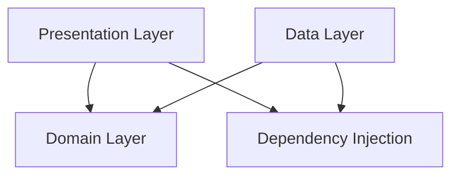

# MeshCipher Architecture

MeshCipher follows **Clean Architecture** principles to ensure separation of concerns, testability, and maintainability. The application is structured into four distinct layers.

## High-Level Overview

## Layers

### 1. Presentation Layer (`presentation/`)
This layer is responsible for the UI and user interaction. It follows the MVVM (Model-View-ViewModel) pattern.

*   **Technologies**: Jetpack Compose, androidx.lifecycle (ViewModel).
*   **Responsibilities**:
    *   Rendering UI components.
    *   Observing state from ViewModels.
    *   Handling user input and navigation.
*   **Key Components**:
    *   `MainActivity`: Single Activity entry point.
    *   `Screen` Composable functions (e.g., `ChatScreen`, `ConversationListScreen`).
    *   `ViewModels`: Mappers that convert Domain models to UI state.

### 2. Domain Layer (`domain/`)
This is the core of the application, containing business logic and enterprise rules. It is completely independent of the Android framework.

*   **Technologies**: Pure Kotlin.
*   **Responsibilities**:
    *   Defining the core entities (Models).
    *   Defining Repository interfaces (abstraction/inversion of control).
    *   Implementing Use Cases (Interactors) that orchestrate logic.
*   **Key Components**:
    *   **Models**: `Message`, `Contact`, `Identity`, `MeshPeer`.
    *   **Use Cases**: `SendMessageUseCase`, `GetMessagesUseCase`.
    *   **Repository Interfaces**: `MessageRepository`, `ContactRepository`, `IdentityRepository`.

### 3. Data Layer (`data/`)
This layer implements the interfaces defined in the Domain layer and handles data retrieval and storage.

*   **Technologies**: Room, Retrofit, Bluetooth, Signal Protocol, IPFS.
*   **Responsibilities**:
    *   Persisting data to the local database.
    *   Communicating with the network (API, TOR, Bluetooth).
    *   Mapping data entities (DTOs) to Domain models.
*   **Key Components**:
    *   **Repositories**: `MessageRepositoryImpl`, `ContactRepositoryImpl`.
    *   **Data Sources**: `MeshDatabase` (Room), `MeshCipherService` (Retrofit), `BluetoothMeshManager`.
    *   **Mappers**: Functions to convert between Database/Network entities and Domain models.

### 4. Dependency Injection (`di/`)
MeshCipher uses **Hilt** for dependency injection to wire up the layers.

*   **Responsibilities**:
    *   Providing singleton instances of Repositories, Managers, and Services.
    *   Managing scopes (Singleton, ViewModelScoped).
    *   Decoupling implementations from interfaces.

## Data Flow

### Example: Sending a Message

1.  **UI Event**: User types a message and clicks "Send" in `ChatScreen`.
2.  **ViewModel**: `ChatViewModel` receives the event and calls `SendMessageUseCase`.
3.  **Domain**: `SendMessageUseCase`:
    *   Validates the message.
    *   Calls `MessageRepository` to save the message locally (pending status).
    *   Calls `TransportManager` to send the message.
4.  **Data**: `TransportManager`:
    *   Determines the best transport (Bluetooth, Internet, or TOR).
    *   Encrypts the message using `SignalProtocolManager`.
    *   Dispatches it via `BluetoothMeshTransport` or `NetworkTransport`.
5.  **Feedback**: The status update flows back up: Data → Domain → ViewModel → UI.
